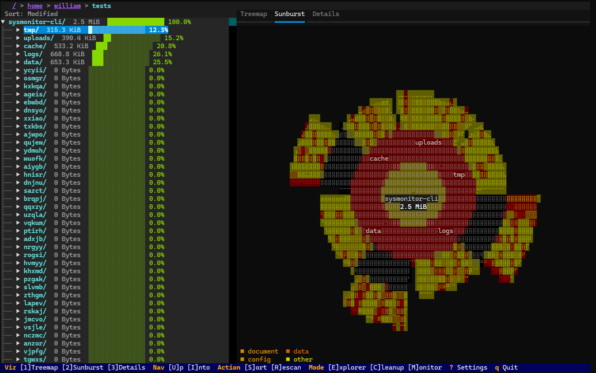
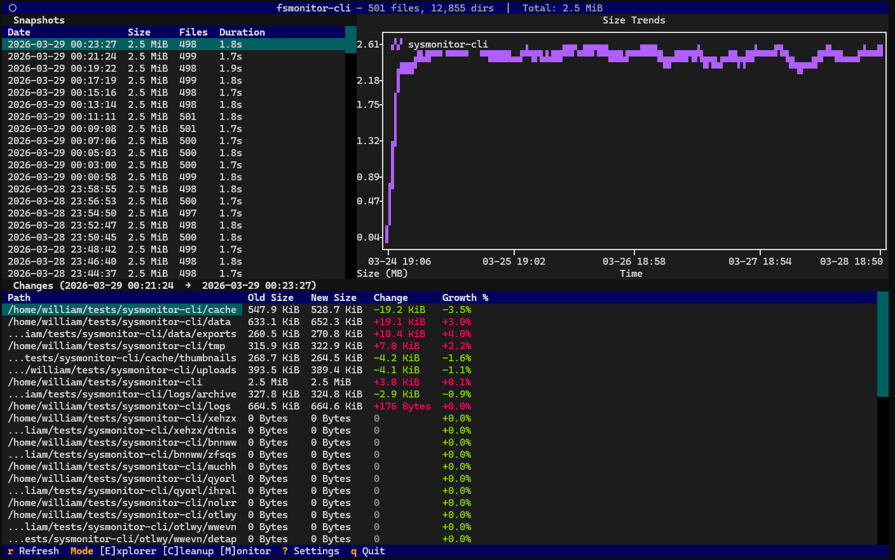

<div align="center">

<h1>DiskTide</h1>

<h3><code>&nbsp;ebb,&nbsp;flow,&nbsp;reclaim&nbsp;</code></h3>

<p>
  <b>Storage intelligence for the terminal.</b><br>
  Built with Python and <a href="https://github.com/Textualize/textual">Textual</a>.
</p>

<p>
  <a href="https://github.com/williamqwu/disktide/actions/workflows/ci.yml">
    </a>
  
  <a href="LICENSE">
    </a>
  
</p>




<p>
  <a href="#installation"><b>Install</b></a> &nbsp;·&nbsp;
  <a href="docs/user-guide.md">User Guide</a> &nbsp;·&nbsp;
  <a href="docs/user-guide.md#cli-commands">CLI</a> &nbsp;·&nbsp;
  <a href="docs/architecture.md">Architecture</a> &nbsp;·&nbsp;
  <a href="docs/contributing.md">Contributing</a>
</p>

</div>

DiskTide is a terminal disk-usage explorer, size monitor, and cleanup tool. It
measures the same tree four ways: logical bytes, allocated blocks, unique
on-disk allocation, and file count. Sparse files, hardlinks, filesystem
boundaries, policy exclusions, and unreadable subtrees stay explicit instead of
collapsing into one ambiguous size number. Space is reclaimed through plans you
review before anything moves, and an applied plan can be undone.

## What it does

- **Explores a tree** with a sorted file tree and three synchronized views:
  sunburst, treemap, and a details panel.
- **Reports four size metrics.** `t` cycles Logical, Allocated, Unique, and
  Files across every view at once, so a sparse file, a hardlink farm, and a
  directory of many tiny files each show up for what they are.
- **Keeps accessibility explicit**: filesystem boundaries, pseudo-filesystem
  mounts, policy exclusions, and unreadable subtrees are reported as coverage
  rather than silently dropped from a total.
- **Records snapshot history** through saved monitors with their own interval,
  scan policy, versioned retention, snapshot pinning, and audited growth alerts.
- **Installs no daemon.** Scans run only while a TUI monitoring session or a
  `disktide watch` foreground host is alive; the repository lease is the single
  ownership contract between them. An optional Linux extra adds
  filesystem-event acceleration, and periodic hosting works without it.
- **Explains a change four ways**: Trend, Diff Treemap, growth-overlay
  Sunburst, and persistent-growth Heatmap, all sharing one space-time
  vocabulary and one baseline/target pair.
- **Cleans up from versioned rule packs** (Python, Node, Rust, general, IDE,
  container). Every apply goes through a persisted CleanupPlan, moves to system
  Trash or an owned quarantine directory, and stays undoable; permanent
  deletion is a separate typed-confirmation path.
- **Ships CLI subcommands** for scripting: `doctor`, `scan`, `compare`,
  `monitor`, `alerts`, `watch`, and `cleanup`.
- **Stores state under XDG paths**, continuing from the older `sizetrail` and
  `fsmonitor-cli` directories when they are the only ones present.

## Installation

DiskTide is not on PyPI yet, so it installs from a checkout. Python 3.10
through 3.14 are supported and the suite passes on all five; the package is
pure Python, so nothing compiles.

```bash
git clone https://github.com/williamqwu/disktide && cd disktide
```

**With uv** — builds a `.venv` from the committed `uv.lock`, so you get the
exact dependency set CI tests against:

```bash
uv sync --locked                 # editable venv, plus the dev tools
uv run disktide                  # or: . .venv/bin/activate && disktide

uv tool install .                # instead: disktide on PATH, own environment
```

**With pip:**

```bash
python -m venv .venv && . .venv/bin/activate
pip install .                    # -e instead of . for an editable install
disktide
```

Both give the same program. Editable is optional either way (`pip install -e .`,
`uv tool install --editable .`); take it if you intend to change the source.
To upgrade a source install, `git pull` and repeat the install command.

### Optional extras

| Extra | Install | Effect |
|---|---|---|
| `watch` | `pip install '.[watch]'`<br>`uv sync --locked --extra watch` | Linux only. Adds `inotify-simple`, so monitors see changes as they happen instead of at the next sweep. Without it, hosting is fully functional in periodic mode. |
| dev tools | included in `uv sync --locked`<br>`pip install -e . pytest pytest-asyncio pytest-xdist textual-dev` | pytest and Textual's devtools, for running the suite and the debug console. |

`disktide doctor` reports the active watch backend, its version and status, and
the command to install it if it is missing. The `export`, `remote`, and `web`
rows it also prints are reserved for later releases and are not installable.

The Python distribution, import package, and canonical command are all named
`disktide`. The previous `sizetrail`, `fsmonitor`, and `fsmonitor-cli` commands
remain available as compatibility aliases. See
[Contributing](docs/contributing.md) for the development workflow.

## Stored data

The app follows XDG conventions and writes below two persistent roots. New
installations use the DiskTide paths shown here. If an existing `sizetrail` or
`fsmonitor-cli` configuration or database is present and the corresponding
DiskTide path is not, DiskTide continues using the newest available legacy
directory so saved monitors, snapshots, cleanup rules, and audit history remain
available.

| Location | Contents | Typical size |
|----------|----------|--------------|
| `~/.config/disktide/config.toml` | User settings | < 1 KB |
| `~/.config/disktide/cleanup-rules/*.toml` | Optional schema-v1 declarative cleanup rule packs | User-defined |
| `~/.local/share/disktide/data.db` | SQLite monitor definitions, snapshots/deltas, retention/alert history, and CleanupPlan/audit records | Depends on tree size and snapshot count |

Legacy paths recognized during upgrade are
`~/.config/sizetrail/`, `~/.local/share/sizetrail/`,
`~/.config/fsmonitor-cli/`, and `~/.local/share/fsmonitor-cli/`.

Snapshot data is written by `scan --snapshot`, explicit monitor runs, and active
foreground monitor hosts. `disktide compare` checks policy and root
compatibility before reporting growth. Monitor Center in the TUI can create,
edit, pause, run, archive, pin, and manage alerts for the same persistent
definitions exposed by the CLI. Its History tab shares one space-time
vocabulary across Trend, Diff Treemap, growth-overlay Sunburst, and
persistent-growth Heatmap views. Definitions do not install a daemon: scans run
only while the current TUI monitoring session or `disktide watch` foreground
host is active. An external supervisor may keep that same foreground host
alive; the repository lease remains the single ownership contract. Versioned
retention policies roll older history into time buckets, preserve pinned
snapshots, and enforce configurable database budgets.

Paths respect `XDG_CONFIG_HOME` and `XDG_DATA_HOME` if set. Settings can also
be edited by pressing `?` inside the TUI. See the
[User Guide](docs/user-guide.md) for the full configuration reference.

## Quick Start

`disktide` has two modes of operation: an **interactive TUI** for visual
exploration (the main interface), and CLI commands for diagnostics, scripting,
monitoring, and cleanup.

### TUI

```bash
# Launch interactive TUI (opens welcome screen)
disktide
```

#### Key Bindings

| Key | Action |
|-----|--------|
| `1` / `2` / `3` | Switch mode (Explorer / Monitor / FS Overview) |
| `c` | Switch to Cleanup mode (enable it in Settings first) |
| `F1` / `F2` / `F3` | Switch visualization (Sunburst / Treemap / Details) |
| `d` / `[` / `]` | Toggle Current/Diff / browse adjacent snapshot pairs |
| `u` / `i` | Navigate up / drill into directory |
| `s` | Cycle sort (Size / Name / Modified) |
| `M` | Set up monitoring for the highlighted Explorer directory |
| `y` / `t` | Copy highlighted path / cycle Logical, Allocated, Unique, Files |
| `r` | Rescan / refresh |
| `b` | Benchmark the highlighted mount in FS Overview (after confirmation) |
| `?` | Settings |
| `q` | Quit |

Mouse support is on by default. Click a tree row, a sunburst arc, or a treemap
rectangle to navigate there; click the sunburst centre to go up one level. The
wheel scrolls, and hovering a chart shape shows its name, size, and share. Hold
Shift while dragging to reach your terminal's own text selection. Launch with
`--no-mouse` for one session, or set `mouse = false` under `[ui]` (Settings ▸
Mouse support) to opt out permanently.

DiskTide measures how tall your terminal's character cell is so the sunburst
comes out round; in the terminals that report no pixel size (xterm.js web
shells, VS Code, ConPTY, mosh, screen) press `,` and `.` in the Explorer to
calibrate it by eye, or set it under Settings ▸ Cell aspect. `disktide doctor`
says which mechanism is in use.

Settings leads with System Information, Scan Performance, and UI Settings; the
longer Cleanup and Monitor sections are collapsed until you open them. The
color theme picker offers Disktide, Cold, Colorblind-safe, Cyberpunk, and Mono,
with a live swatch row of the selected theme so the choice is visible before you
leave the screen. Each theme retints the whole window, not just the charts, and
each one's six category colors are validated for colour-vision separation and
contrast against its own background.

Inside Monitor Center, use `n` to create a monitor, `e` to edit it, `p` to
pause/resume, `R` to run now, `g` to request a trusted full reconciliation, and
`s` to start/stop the current TUI host. The History tab puts Trend, Diff Map,
Growth Rings, and Heatmap on `F1` through `F4`; `b` and `v` mark the
highlighted snapshot as baseline/target, while `l` restores latest/previous.
The footer keeps the mode hint visible there; press `1` to return to Explorer
without conflicting with lowercase `e` for Edit.

Cleanup is disabled by default in the TUI. After enabling it in Settings, press
`c` to review candidates from versioned Python, Node, Rust, general, IDE, and
container rule packs. The Age/Size Map ranks opportunities without treating a
score as proof of safety; press `m` to focus it and `h` for grouped savings
history. Select candidates and press `d` to review a persisted CleanupPlan.
Normal apply uses system Trash when an atomic same-filesystem move is available
and otherwise uses an owned quarantine directory; `u` restores the latest
recoverable plan. Detection-only provider caches cannot be applied through the
generic executor. Permanent deletion is a separate typed-confirmation path.

### CLI

Outside the TUI, `disktide` offers `doctor`, `scan`, `compare`, `monitor`,
`alerts`, `watch`, and `cleanup`. Every command puts results on stdout and run
status on stderr, and `--help` works at each level. The
[CLI chapter of the User Guide](docs/user-guide.md#cli-commands) documents each
one, with the stream and exit-code contract, the JSON output, and every flag.

## Documentation

- **[User Guide](docs/user-guide.md)**: usage, configuration, and every key binding.
- **[CLI Reference](docs/user-guide.md#cli-commands)**: the scripting contract
  (streams, exit codes, `--json`) and every subcommand.
- **[Architecture](docs/architecture.md)**: internals, including scanner
  threading, database schema, visualization algorithms, and screen management.
- **[Filesystem Compatibility](docs/fs.md)**: supported filesystems, every
  syscall the tool makes, and platform-specific behavior.
- **[Release Process](docs/release-process.md)**: locked builds, clean-wheel
  smoke tests, checksums, SBOM, provenance, and PyPI publishing.
- **[Delivery Waves](docs/waves/README.md)**: interactive feature,
  architecture, and validation briefs for Waves 01 to 07.
- **[Contributing](docs/contributing.md)**: dev setup, testing, and how to add
  rules, screens, or visualizations.

## License

[Apache License 2.0](LICENSE).
