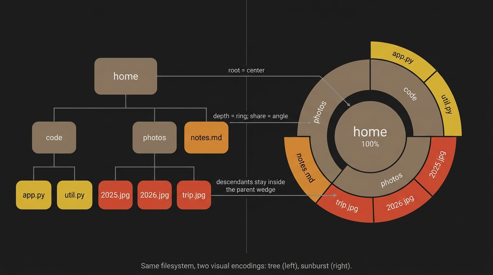

# Reading the sunburst: from radial space-filling charts to your home directory

*A short field guide to the chart in the right panel.*

*Updated 2026-08 for v0.2.24: the renderer described here has since moved from
braille stippling to anti-aliased half-blocks, the color model was rebuilt
around six validated categories with dominance-tinted directories, and arcs
are clickable now that mouse support is back. The reading model below is
unchanged; details that drifted have been corrected in place.*

## Where the shape comes from

Hierarchical disk usage has been a visualization problem since "my disk is full and I don't know why" became a daily question. The two designs that solved it both came out of academic infovis labs:

- **Treemap** (Ben Shneiderman, University of Maryland, 1991). Invented to visualize a shared lab disk where "everyone's hard disks were full but no one wanted to spend the time to clean up." Nested rectangles, each sized by the file or subtree it represents. The seminal paper is [Shneiderman, "Tree visualization with tree-maps: 2-d space-filling approach," ACM TOG 11(1) 1992](https://www.cs.umd.edu/users/ben/papers/Shneiderman1992Tree.pdf).
- **Sunburst** (John Stasko and Eugene Zhang, Georgia Tech, 2000). A radial reformulation of the same idea: rings instead of nested rectangles, with arc angle (not rectangle area) encoding share. Formalized in [Stasko and Zhang, "Focus+Context Display and Navigation Techniques for Enhancing Radial, Space-Filling Hierarchy Visualizations," IEEE InfoVis 2000](https://www.cc.gatech.edu/~john.stasko/papers/infovis00.pdf). Earlier precursors include Andrews and Heidegger's "Information Slices" (1998) and Chuah's circular treemaps (1998), but the Stasko and Zhang paper is the one most modern implementations cite.

For disk usage specifically, the lineage runs through three desktop tools that brought the radial chart to a general audience: **Filelight** on KDE (2004), **DaisyDisk** on macOS (2010), and the rings view in GNOME's **Baobab**. Our `disktide` renders the same family of chart, but with two unusual constraints: it has to run in a terminal (no SVG, no canvas; we paint with anti-aliased half-block cells) and it has to update incrementally as the scan runs.

## Why it fits a Linux filesystem so cleanly

A Linux filesystem is a tree by definition. Every directory is a node, every file is a leaf, every path is a walk from the root. Three things make a sunburst the right picture for that tree:

1. **Hierarchy is depth, not adjacency.** Concentric rings encode "how deep in the tree" naturally. The center is your scan root; ring 1 is its direct children; ring 2 is grandchildren; and so on. You read distance from center as filesystem depth without any extra cue.
2. **Cumulative size is the only thing that matters for "what's eating my disk."** The arc angle of a slice is exactly its share of the parent's total. A subtree that owns 30 % of your home's bytes owns 30 % of the inner ring. You see dominance at a glance.
3. **Locality is preserved.** Every descendant of `~/Documents` sits inside that one outer arc-pie wedge. The chart lets your eye trace a path: see a fat outer slice, follow it inward, find the directory it lives in.

That third property is what a flat sorted list of `du -sh` outputs cannot give you. You see the *structure* of where the bytes live, not just the leaderboard.

*The same filesystem, two encodings. The root maps to the center disc; depth maps to ring number; each parent's bytes are distributed among its children clockwise around its arc; a descendant always stays inside its ancestor's wedge.*

## Reading our chart

*Anatomy of the chart. The same seven labels are unpacked below.*

Open the explorer and press `1`. What you see, decoded:

- **The center disc** is the scan root. The label inside it is the directory name and total size (or file count, if you've pressed `t` to toggle the metric).
- **Each concentric ring is one level deeper.** Ring 1 is the top-level entries inside the scan root; ring 2 is one step further down; rings beyond stop at depth 4 (depth 2 while a scan is still in flight, so the picture stabilises before the deep rings fill in).
- **Arc angle is share of the parent.** A 90-degree arc on ring 1 means that subtree holds a quarter of the scan root's total. A thin sliver is a small one.
- **Color encodes content type — for directories too.** Files take one of six category hues (code, docs, data, media, archives, ephemeral build/log output) that stay the same in every theme and were chosen to remain pairwise distinguishable under colorblind simulation; you can tell at a glance whether a fat subtree is "all code" vs "all media." A directory is tinted towards whatever category dominates its bytes — the more one-sided the subtree, the stronger the tint — and stays neutral gray when nothing holds a majority, so the inner rings carry the same story as the leaves. Known regenerable containers — virtual envs, `node_modules`, `__pycache__` and the other tool caches — are read wholesale as ephemeral instead of by extension, since the `.py` files inside a venv are installed payload and not your code; without that a venv comes out an even code/ephemeral tie at every level and the whole wedge goes gray. Directory tints run at lower chroma on a darker ladder than file arcs, so a folder arc never gets confused with a file arc. The bottom-left legend lists the categories present with each one's share of the scanned bytes.
- **Label suffix glyphs** mark accessibility state: `⚠` is fully unreadable (permission denied at scan time); `◐` is partial (we could read the directory but at least one entry inside was inaccessible). The breadcrumb at the top echoes the same state for the current scan root.
- **Press `t`** to toggle whether arc angles encode total size (bytes) or file count. Same tree, different question. "Where are my bytes" vs "where are my files" are answered by the same visualization with one keypress between them.
- **Press `2`** to switch to the treemap view of the same tree. It answers the same questions, with nested rectangles instead of rings; some people read areas faster than angles, and the treemap fits more depth at small sizes.

## What the chart is bad at, and what to use instead

A sunburst is great for "which subtree is dominant" and bad for "what's the absolute size of this one leaf." The center occupies a fixed fraction of the canvas regardless of how much data lives there; very small files at deep rings vanish into hair-thin arcs too small to click. For those questions, drop into the left tree panel and let it sort by size, or open the Details tab on the selected node.

Two more useful properties our implementation inherits from the radial form. **Outer-ring instability during a scan** is intrinsic: until a subtree's children have all returned, the deepest rings don't have honest sizes. We damp this by rendering at reduced `max_depth` while the scan is in flight, restoring full depth on completion. And **arc reordering** as bigger subtrees land is also intrinsic: arcs sort by size, so a slow subtree can leap from a sliver on the right to dominating half the ring once it finishes. Both are expected behaviour, not bugs; they're the price of seeing the chart form live instead of waiting for the full scan.

## Further reading

- Shneiderman's [TreeViz history page](https://www.cs.umd.edu/hcil/treemap-history/): original treemap motivation, in his own words.
- Stasko's [Sunburst InfoVis 2000 paper](https://www.cc.gatech.edu/~john.stasko/papers/infovis00.pdf): the formal sunburst introduction, including focus+context techniques we don't (yet) implement.
- Filelight on [GitHub](https://github.com/KDE/filelight): the longest-lived radial disk visualizer in active use.
